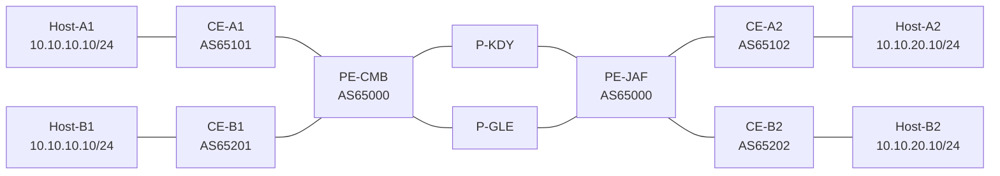

# CarrierNet-LK

**Resilient Multi-Tenant IP/MPLS L3VPN Service-Provider Core**

CarrierNet-LK is an educational service-provider lab for learning and proving
OSPF, MPLS/LDP, MP-BGP VPNv4, VRFs, PE-CE eBGP, failure recovery, QoS, and
operational verification. It is a fictional topology and **is not the real
network design of Dialog, SLT-Mobitel, Hutch, or any other operator**.

> Status: Phase 1 design scaffold complete. GNS3 and the lab appliances are not
> yet installed or verified. No MPLS configurations or measured results are
> claimed at this stage.

This is a new repository. Its predecessor,
[Sri-Lanka-Telco-Core](https://github.com/projectswnimee/Sri-Lanka-Telco-Core),
is used only as a reference for evidence-backed testing, reproducible
configurations, and documentation style. CarrierNet-LK moves beyond Packet
Tracer to a platform capable of a genuine MPLS L3VPN control and data plane.
The specific carry-forward decisions are documented in
[`docs/predecessor-review.md`](docs/predecessor-review.md).

## Phase 1 outcome

| Deliverable | State | Record |
|---|---|---|
| Hardware assessment | Provisional pass | [`docs/hardware-assessment.md`](docs/hardware-assessment.md) |
| Platform decision | Selected; installation pending | [`docs/platform-decision.md`](docs/platform-decision.md) |
| Logical topology and interface map | Reviewed design | [`docs/architecture.md`](docs/architecture.md) |
| IP, AS, VRF, RD, and RT plan | Reviewed design | [`docs/addressing-plan.md`](docs/addressing-plan.md) |
| Repository scaffold | Complete | This repository |
| Installation verification | Not run | [`docs/installation-verification.md`](docs/installation-verification.md) |
| Project scope | Complete | [`docs/scope.md`](docs/scope.md) |

## Planned topology

The two core paths form the required provider diamond. Customer A and Customer
B deliberately reuse `10.10.10.0/24` and `10.10.20.0/24`; their routes remain
separate because each customer is placed in a distinct VRF.

## Baseline design

- Provider AS: `65000`
- Underlay: OSPF area 0 over four `/31` links
- Transport: MPLS with LDP on provider-facing links only
- Service control plane: direct MP-BGP VPNv4 between PE loopbacks
- Customer service: two VRFs and PE-CE eBGP
- Customer A: `VRF-CUST-A`, RD/RT `65000:100`
- Customer B: `VRF-CUST-B`, RD/RT `65000:200`
- Provider nodes: four MikroTik CHR RouterOS v7 VMs
- Customer edges: four lightweight FRRouting containers
- End hosts: four VPCS nodes

## Build order

1. Verify the Windows host, hypervisor, GNS3 VM, and appliance versions.
2. Build and cable the topology exactly as documented.
3. Configure interface state and point-to-point addresses.
4. Prove IP reachability and OSPF before enabling MPLS.
5. Add LDP and prove label-switched paths.
6. Add MP-BGP VPNv4, VRFs, and PE-CE eBGP.
7. Prove reachability, isolation, overlapping addressing, and P-router route hygiene.
8. Run measured failure and QoS experiments.

Do not skip layers. Each phase has explicit pass/fail gates in
[`docs/test-plan.md`](docs/test-plan.md).

## Repository map

| Path | Purpose |
|---|---|
| `topology/` | Draw.io source, SVG, and rendered PNG |
| `configs/` | Version-controlled device exports added phase by phase |
| `docs/` | Architecture, plans, procedures, limits, and analysis |
| `automation/` | Inventory, health checks, and automated tests |
| `evidence/` | Raw command output, captures, screenshots, and measurements |
| `results/test-results.csv` | Test register; `not_run` is used until evidence exists |

## Evidence policy

- Never commit router images, licence files, passwords, private keys, or tokens.
- Never fabricate command output, packet captures, screenshots, or measurements.
- Keep raw evidence immutable; analysis belongs in `docs/` or `results/`.
- Every performance or resilience claim must identify its test ID and evidence path.

## Official references

- [GNS3 documentation](https://docs.gns3.com/docs)
- [GNS3 VM usage](https://docs.gns3.com/docs-3.1-en/gns3-vm/gns3-vm-usage)
- [MikroTik CHR](https://help.mikrotik.com/docs/spaces/ROS/pages/18350234/Cloud%20Hosted%20Router%20CHR)
- [MikroTik LDP](https://help.mikrotik.com/docs/spaces/ROS/pages/121995275/LDP)
- [MikroTik VRF and L3VPN](https://help.mikrotik.com/docs/spaces/ROS/pages/328206/Virtual%20Routing%20and%20Forwarding%20-%20VRF)
- [FRRouting](https://frrouting.org/)

## Licence

MIT. See [`LICENSE`](LICENSE).
