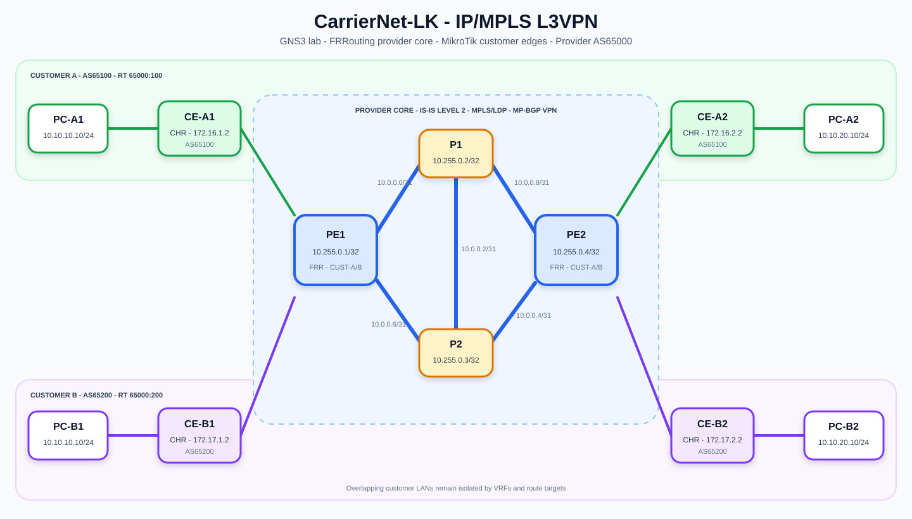
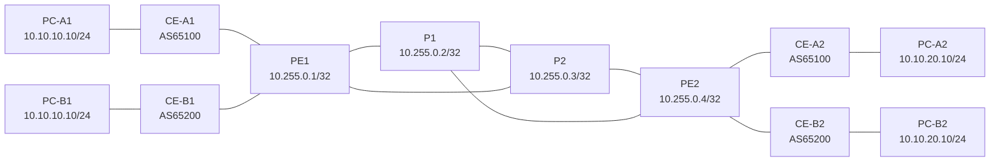

# CarrierNet-LK

**Resilient multi-tenant IP/MPLS L3VPN service-provider lab**

CarrierNet-LK is a 12-node GNS3 lab that demonstrates how a service provider
can carry two customers with overlapping IPv4 address space across a shared,
redundant MPLS core. The implementation uses IS-IS for the underlay, LDP for
label distribution, MP-BGP for VPN route exchange, Linux VRFs for tenant
isolation, and eBGP at the provider/customer boundary.

The lab is fictional and does not represent the internal network of a real
telecommunications operator.



## What was built

| Layer | Implementation | Validated result |
|---|---|---|
| Emulation | GNS3 2.2.61 with GNS3 VM on VMware Workstation | 12 nodes and 13 links operated together |
| Provider underlay | Four FRRouting 10.3 routers using level-2 IS-IS | All expected adjacencies and loopback routes formed |
| MPLS transport | LDP with loopback router IDs and ECMP core paths | Operational LDP neighbours and populated LFIB |
| VPN control plane | MP-BGP IPv4 VPN between PE1 and PE2 in AS65000 | Four VPN routes exchanged with labels and RTs |
| Tenant isolation | `CUST-A` table 100 and `CUST-B` table 200 | Overlapping LAN prefixes coexist in separate VRFs |
| Customer access | Four MikroTik CHR 7.22.1 CEs using eBGP | All PE-CE sessions established |
| Data plane | Four VPCS endpoints | Site-to-site pings passed for both customers |
| Resilience | Two independent PE-to-PE core paths | Traffic recovered after either P router was stopped |
| Recovery automation | Persistent FRRDocker startup scripts | IS-IS, LDP, MPLS sysctls and PE VRFs recovered after restart |

## Topology

The provider core has five links, giving each PE two principal paths to the
remote PE:



- Customer A uses RT `65000:100`.
- Customer B uses RT `65000:200`.
- Each PE uses a unique RD per customer site.
- P1 and P2 carry provider routes and labels; they do not hold customer VRFs.
- Customers intentionally reuse `10.10.10.0/24` and `10.10.20.0/24`.

## Key engineering decisions

- `/31` subnets conserve addresses on point-to-point provider links.
- `/32` loopbacks provide stable IS-IS, LDP and MP-BGP identities.
- Separate RTs prevent route exchange between customers.
- `as-override` supports two sites using the same customer AS.
- MPLS is enabled only on provider-facing links.
- The P routers remain unaware of customer IPv4 prefixes.
- Recovery hooks restore container state that FRRDocker does not retain at runtime.

## Repository map

| Path | Purpose |
|---|---|
| [`lab/`](lab/) | GNS3 project definition without proprietary appliance images |
| [`topology/`](topology/) | Logical topology diagram |
| [`configs/`](configs/) | Sanitized FRR, RouterOS and VPCS configurations |
| [`automation/`](automation/) | Tested core and PE restart-recovery scripts |
| [`docs/`](docs/) | Architecture, addressing, protocol design and reproduction guide |
| [`evidence/`](evidence/) | Selected raw outputs captured during validation |
| [`results/test-results.csv`](results/test-results.csv) | Honest pass/not-run test register |

## Reproduce the lab

1. Install GNS3 2.2.61, the matching GNS3 VM and VMware Workstation.
2. Import MikroTik CHR 7.22.1 and the `FRRDocker` appliance.
3. Import [`lab/CarrierNet-LK.gns3`](lab/CarrierNet-LK.gns3), or recreate the
   links from [`docs/architecture.md`](docs/architecture.md).
4. Apply the provider, CE and host configurations from [`configs/`](configs/).
5. Install the recovery hook described in
   [`automation/scripts/README.md`](automation/scripts/README.md).
6. Run the checks in [`docs/validation.md`](docs/validation.md).

Appliance images are deliberately excluded. Download them from their official
sources and verify their checksums before use.

## Verified highlights

```text
PE1# show isis neighbor
Area CORE:
System Id  Interface  L  State
P1         eth0       2  Up
P2         eth1       2  Up

PE1# show mpls ldp neighbor
10.255.0.2  OPERATIONAL
10.255.0.3  OPERATIONAL
```

The PE1 VPN table contained four routes: a local and remote site prefix for
each customer. End-to-end ICMP then passed independently in both VRFs. During
a P-router shutdown, packet loss occurred briefly and traffic reconverged over
the surviving labelled path.

## Scope and limitations

This is an educational implementation, not a production reference design. It
does not yet include route reflectors, PE multihoming, QoS benchmarking,
automated packet-capture analysis or timing-grade convergence measurements.
See [`docs/limitations.md`](docs/limitations.md) for the full list.

## Security and licensing

- No router passwords, tokens, private keys, licence files or appliance images
  are committed.
- Configuration files contain private lab addresses only.
- Code and documentation are licensed under the [MIT License](LICENSE).
- RouterOS, FRRouting, GNS3 and VMware retain their respective licences.
