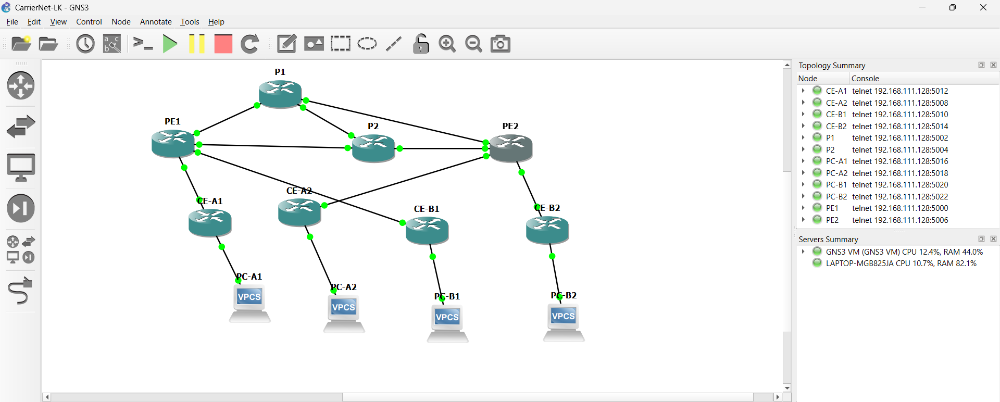

# Screenshots

## Cropped README preview

The repository and profile READMEs use a non-AI, lossless rectangular crop of
the original: `x=0, y=0, width=1920, height=772` pixels. It removes the bottom
console (including setup-error messages), status strip and Windows taskbar.
The topology, node list and every retained pixel are unchanged. The full
original remains below for context; cropping does not establish that the lab
had no errors.

## Original GNS3 capture

Original capture from 4 September 2026, 11:32 local time. The topology and
node list show the 12-node lab with running indicators. The image is copied
unchanged from the saved screenshot; the console retains earlier setup errors.
A running indicator alone does not verify routing, VPN isolation or failover.

Protocol and traffic evidence is in [command-outputs](../command-outputs/),
with the [test register](../../results/test-results.csv) recording results
and limitations. This capture documents the environment at that point in the
build, not a fresh execution of every test.
