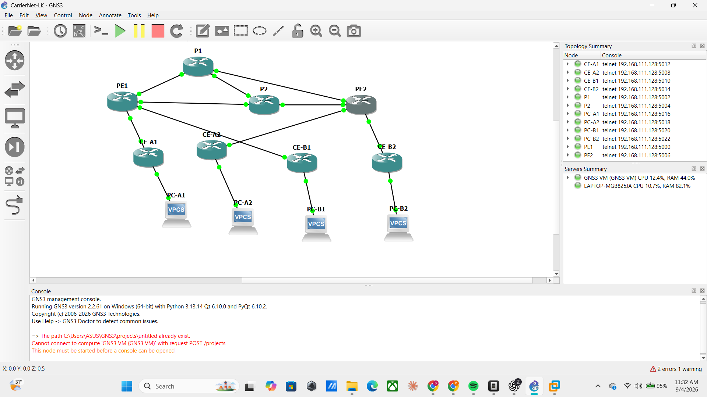

# Screenshots

## Original GNS3 capture

Original capture from 4 September 2026, 11:32 local time. The topology and
node list show the 12-node lab with running indicators. The image is copied
unchanged from the saved screenshot; the console retains earlier setup errors.
A running indicator alone does not verify routing, VPN isolation or failover.

Protocol and traffic evidence is in [command-outputs](../command-outputs/),
with the [test register](../../results/test-results.csv) recording results
and limitations. This capture documents the environment at that point in the
build, not a fresh execution of every test.
